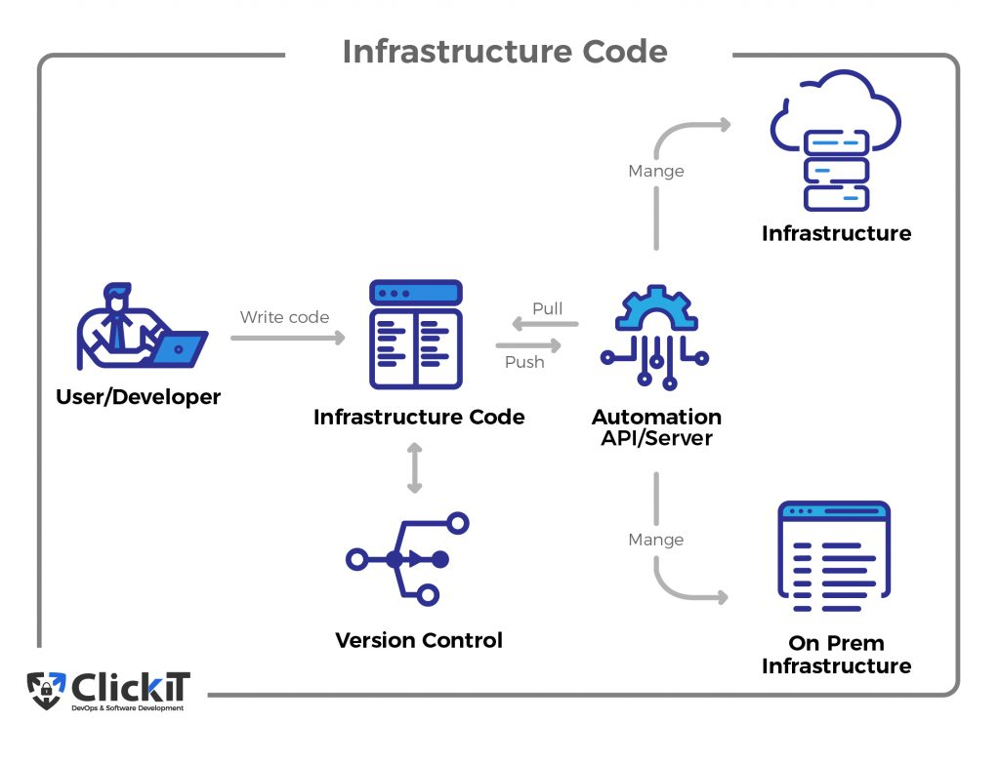

# infrastructure-as-code: 

A way of creating and maanging computer systems through specilised code. instead of having to manually set up servers, we can write code that provisons or describes how the system should be built. Its like using a set of instructions to create an environment or infrastructure. 


# Ansible:
Ansible is a suite of software tools that enables infrastructure as code.




In the diagram the user writes code which is then saved, stored and monitored through version control, it is then pushed to an automation server, and then managed and sent it to different architectures. It could be put on the cloud or to an on premises aritecture. 

(Read more here)[https://www.clickittech.com/devops/infrastructure-as-code-tools/]

How is it powerful/ useful? we can create and control as many nodes as we please through the controller. 

How is it simple? we only need to deal with the controller node, not every indivual node. 

Agentless: the software only needs to be installed on the master node, (controller). This makes it agentless. there is no need to install ansible on eevry device. 

## Example (plan):

The best way to understand it is to explain it through an example, 


1. We (the devloper) can use something like vagrant to create virtual machines, we can then use ssh to connect to a controller. 

2. 1 of the machines we will make is called an Ansible controller. This is like the root node, only 1 device needs this installed as we can control all other virtual machines from here. We connect through it via ssh. 

3. another machine is called the app machine/node, and the last machine is called the db machine/node. we can connect to these through passwords via the controller machine. 

4. The app and db machines work together to populate the data. (Create enviornment variables etc)

5. The app machine must run NodeJS 
6. The db machine must run the database. 

7. The Master node can be installed locally, whereas the other nodes can be on a cloud provider like AWS.

# Setting up:

Ensure the file is in the right folder and that you are in the right directory on your terminal,

run: `Vagrant up`, we can check if it has ran successfully by running `Vagrant status` or by checking the VirtualBox app:


# step 1: SSH in

run: 
```
vagrant ssh controller
```
to get into the controller node. 

once in we can connect to the different nodes, i.e: the web and db. 

# step 2: update the nodes

we need to go in and update them:
run the following to get into the web node:
```
ssh vagrant@192.168.33.10
```
the password is `vagrant` and is invisible.
run:
```
run sudo apt update -y 
```
to update. run `exit` to leave web.

Now update the db node: go in:
```
ssh vagrant@192.168.33.11
```
as you can see we are in the `db`. 


update: 
```
sudo apt update -y
```


# step 3: install ansible

naviagte to the controller in the terminal and run:
this installs common pacakages
```
sudo apt install software-properties-common
```
Add the repository:
```
sudo apt-add-repository ppa:ansible/ansible
```
now update and install:
```
sudo apt update -y
sudo apt install ansible -y
```


check the version:
```
sudo ansible --version
```


# step 4: install tree

naviagte to the correct directory:
```
/etc/ansible
```
should looklike:


install the tree:
```
sudo apt install tree -y
```

we can run Just `"Tree"` to see it in a different layout:


# Step 5: change hosts file

We can check connectivity between hosts/ nodes throgh using the `ping` command, if there is a successful connection established, it should return with `pong`. To do this follow:

once in the correct directory (`/etc/ansible`), we can run the following to get into the hosts file to modify it:
```
sudo nano hosts
```

add the lines:
```
[web]
192.168.33.10 ansible_connection=ssh ansible_ssh_user=vagrant ansible_ssh_pass=vagrant
```
shown in:


save it and run 
```
sudo ansible web -m ping
```
with the output:


PONG!

## db

to get a PONG from the db we need to add a line to the hosts file:
```
[db]
192.168.33.11 ansible_connection=ssh ansible_ssh_user=vagrant ansible_ssh_pass=vagrant
```

